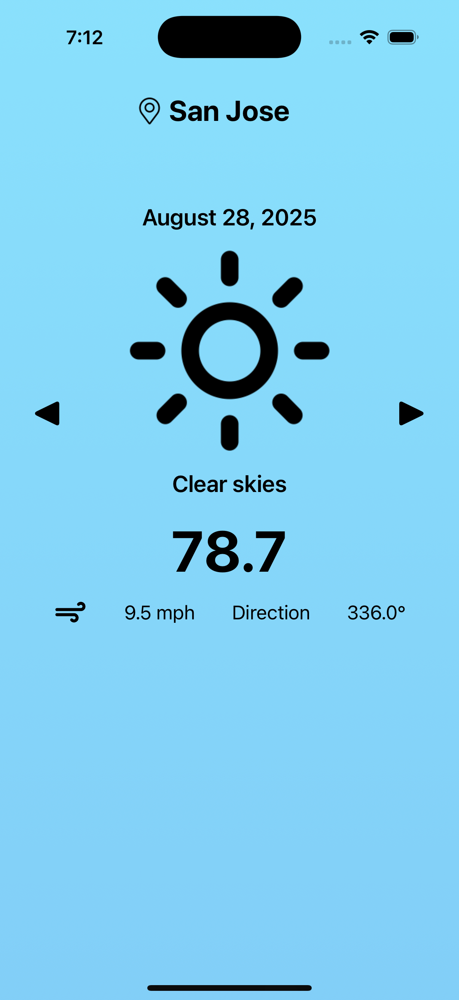

# 🌤️ CloudCast – Real-Time Weather App  

CloudCast is an iOS weather app that fetches and displays **real-time weather forecasts** from the [Open-Meteo API](https://open-meteo.com/).  
Built with **Swift, UIKit, and URLSession**, it demonstrates networking, JSON parsing with **Decodable**, and dynamic UI updates.  

---

## 🚀 Features  
- ✅ Fetch live weather data from the internet  
- ✅ Switch between multiple predefined locations (San Jose, Manila, Italy)  
- ✅ Display temperature, wind speed, and wind direction  
- ✅ Show weather conditions with icons and descriptions  
- ✅ Simple and clean UIKit-based interface  

---

## 🛠️ Technologies & Concepts  
- **Postman** – explored and tested API endpoints  
- **URLSession** – created network requests in iOS  
- **JSON Parsing** – converted API responses into Swift data models  
- **Decodable Protocol** – parsed JSON into Swift structs automatically  
- **UIKit** – managed the interactive UI  

---

## 📸 App Preview  

  

---

## 📖 How It Works  
1. User selects a location using navigation arrows  
2. App makes a **URLSession request** to the Open-Meteo API  
3. JSON response is decoded into Swift structs (`Decodable`)  
4. Weather data (temperature, wind, condition) updates on screen  

---

## 🔮 Future Improvements  
- [ ] Allow users to add custom locations  
- [ ] Add hourly and daily forecast support  
- [ ] Integrate geolocation for current location weather  
- [ ] Enhance UI with animations and additional weather icons  

---

## 📚 Resources  
- [Open-Meteo API Docs](https://open-meteo.com/)  
- [Apple URLSession Documentation](https://developer.apple.com/documentation/foundation/urlsession)  
- [Swift Decodable Guide](https://developer.apple.com/documentation/swift/decodable)  

---

